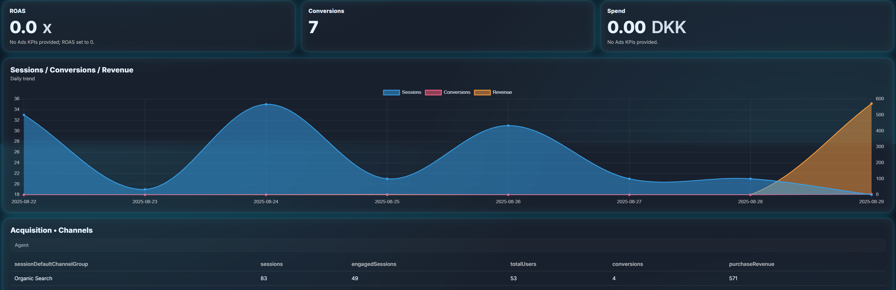

# Intelligent Dashboard

> Ask better questions → get better dashboards.  
> A tiny PHP app that renders analytics dashboards from JSON, featuring:
>
> - 🧠 **Smart section ordering** (e.g. “Acquisition • …”, “Ads • …”)
> - 📊 **KPI strip** always first + a **hero chart**
> - 🗂 **GA4 Property** picker (cached to disk)
> - 🤖 **Proxy** to your n8n flow (returns a new dashboard)
> - 🔒 **First-run setup + login** (stored in `.env`)
> - 🧼 **Fallback blur** for mock data

<p align="center">
  <!-- Replace these with your real images (see "Add images" below) -->
  
</p>

---

## Contents

- [Demo screenshots](#demo-screenshots)
- [How it works](#how-it-works)
- [Quick start (local, Docker)](#quick-start-local-docker)
- [EasyPanel install (step-by-step)](#easypanel-install-step-by-step)
- [Configuration](#configuration)
- [Webhook payloads (n8n + GA properties)](#webhook-payloads-n8n--ga-properties)
- [File/Folder map](#filefolder-map)
- [Add images](#add-images)
- [Troubleshooting](#troubleshooting)
- [Contributing](#contributing)
- [License](#license)

---

## Demo screenshots

> Put images in `docs/images/` and replace the filenames below.

- **Overview**  
  ``

- **Property picker**  
  ``

- **First-run setup**  
  ``

> Tip: You can also drag & drop images into a GitHub issue/comment and reuse the generated URLs here.

---

## How it works

1. **`index.php`** renders your dashboard JSON (or a built-in sample when no input).  
   - Keeps **KPI cards** at the top, then the **first chart**, then remaining sections.  
   - Includes a **GA4 Property** dropdown (fetched once from your webhook and saved to `ga_properties.json`).  
   - Has an **Ask** bar that posts to `proxy.php` (with the question + selected property).

2. **`proxy.php`** receives your question (and property), calls your **n8n webhook**, then posts the resulting dashboard wrapper to the **renderer** (`index.php` by default). It finally returns **full HTML** to the browser.

3. **`auth.php`** is included at the very top of pages:
   - Shows a **first-run setup wizard** if `.env` is missing (creates it).  
   - Provides a **login** when `.env` exists but the session isn’t authenticated.  
   - Exposes `.env` values as constants once logged in.  
   - Logout via `?logout=1`.

Architecture sketch:

```
Browser  ──[POST /proxy.php {question, property}]──▶  n8n (N8N_WEBHOOK)
   ▲                                                     │
   │                                returns: { json: <dashboard>, output: {...} }
   │                                                     ▼
   └───── receives full HTML ◀──── proxy ──[POST wrapper]── RENDERER_URL (index.php)
```

---

## Quick start (local, Docker)

### A) Run locally (PHP built-in server)

```bash
git clone https://github.com/sitepointsystems/Intelligent-Dashboard.git
cd Intelligent-Dashboard

# Start a local PHP server on http://localhost:8000
php -S 0.0.0.0:8000
```

Open `http://localhost:8000/index.php` → you’ll see the **first-run setup**.  
Enter:

- Username + password  
- `PROP_WEBHOOK_URL` (returns GA accounts/properties JSON)  
- `N8N_WEBHOOK` (your n8n flow that answers questions)  
- `RENDERER_URL` *(optional; defaults to this app’s URL)*

The wizard writes a `.env` file next to your PHP files.

---

### B) Run with Docker

```bash
docker build -t intelligent-dashboard .
docker run --rm -p 8080:80 intelligent-dashboard
```

Open `http://localhost:8080` and complete the setup wizard.

> **Persisting `.env` / property file**  
> By default, `.env` and `ga_properties.json` live in the app directory.  
> If you want to keep them across redeploys:
>
> - Mount a volume that contains those files, **or**
> - (Recommended) adjust the code to use `/data/.env` & `/data/ga_properties.json` and mount a volume at `/data`.

---

## EasyPanel install (step-by-step)

Deploy straight from this GitHub repo.

1. **Create a new App**
   - EasyPanel → *Apps* → **New App** → **Git Repository**
   - **Repository URL:** `https://github.com/sitepointsystems/Intelligent-Dashboard.git`
   - **Branch:** `main` (or your branch)

2. **Build settings**
   - **Build type:** `Dockerfile`
   - **Dockerfile path:** `/Dockerfile` (repo root)
   - **Build args:** *(none)*
   - **Auto Deploy:** optional

3. **Run settings**
   - **Container Port:** `80`
   - **Healthcheck Path:** `/proxy.php?ping=1` *(or `/index.php?ping=1` if you add one)*

4. **Storage (optional but recommended)**
   - To persist `.env` and `ga_properties.json` across updates:
     - Mount a volume that holds those file(s), **or**
     - Switch paths to `/data/.env` & `/data/ga_properties.json` and **mount a volume to `/data`**.

5. **Domains / SSL**
   - Attach your domain → enable SSL
   - Open the domain to run the **setup wizard**

---

## Configuration

### First-run wizard (`auth.php`)

When `.env` doesn’t exist, you’ll be asked for:

- `USERNAME`
- `PASSWORD` (stored as `PASSWORD_HASH`)
- `PROP_WEBHOOK_URL` — Webhook/endpoint returning GA accounts & properties
- `N8N_WEBHOOK` — n8n flow that answers questions and returns a dashboard wrapper
- `RENDERER_URL` — Where the renderer lives (defaults to this app’s URL)

After submit:

- `.env` is written
- You’re auto-logged in
- You can use the app

> Logout: append `?logout=1` to the URL

### GA4 property dropdown

- On first use, the app calls `PROP_WEBHOOK_URL` and saves the normalized list to `ga_properties.json`.
- Click **“Refresh Properties”** to rebuild the file (if you expose such a button/route).
- The dropdown stores the selection in a **cookie** and uses **POST** (no URL param leak).
- Only the **numeric** property id is sent to n8n (derived from `properties/123456789` → `123456789`).

---

## Webhook payloads (n8n + GA properties)

### 1) Frontend → `proxy.php`

`proxy.php` expects JSON:

```json
{
  "question": "Show me last 14 days ROAS",
  "propertyId": "250097593",
  "propertyFull": "properties/250097593",
  "dashboard": { "...": "optional context" }
}
```

### 2) `proxy.php` → `N8N_WEBHOOK`

We forward (at least):

```json
{
  "question": "Show me last 14 days ROAS",
  "dashboard": { "...": "optional context" },
  "propertyId": "250097593",
  "propertyFull": "properties/250097593"
}
```

### 3) n8n response → `proxy.php`

Return a **wrapper** that includes a dashboard JSON under `json`:

```json
{
  "json": {
    "version": "1.0",
    "theme": { "mode": "dark", "accent": "#27E1FF", "brand": "Intelligent Dashboard" },
    "period": { "start": "2025-08-09", "end": "2025-08-22", "compare": { "type": "previous_period" } },
    "layout": { "columns": 12, "cards_order": ["kpi_roas","ts_perf"] },
    "cards": [ /* ... */ ],
    "agent_summary": "ROAS improved by 0.35 vs previous period ..."
  },
  "output": {
    "answer": "Natural language summary (optional)",
    "whatsnext": "Next steps (optional)",
    "order": { "acquisition": 1, "ads": 2, "engagement": 3 },
    "explanations": {
      "ads": "We prioritized Ads because you asked for last week’s Ads data ..."
    }
  }
}
```

`proxy.php` then posts this wrapper to `RENDERER_URL` (usually `index.php`) with `Accept: text/html`. The renderer returns **HTML**.

### 4) `PROP_WEBHOOK_URL` (GA properties)

We accept several shapes; they are normalized into:

```json
[
  { "accountId": "123", "propertyId": "properties/999", "displayName": "Site A" },
  { "accountId": "123", "propertyId": "properties/1000", "displayName": "Site B" }
]
```

Supported inputs:

- `{ "accounts_and_properties": [ {accountId, propertyId|name, displayName}, ... ] }`
- `{ "accounts": [ { "accountId": "123", "properties": [ {propertyId|name, displayName}, ... ] } ] }`
- A raw array of items with the same keys

The list is saved as `ga_properties.json`.

---

## File/Folder map

```
/
├─ Dockerfile
├─ index.php          # main renderer + UI (KPI strip, hero chart, sections, property picker, Ask bar)
├─ proxy.php          # calls n8n, then posts wrapper to index.php → returns HTML
├─ auth.php           # login + first-run setup; writes/reads .env
├─ .env               # created by setup (USERNAME, PASSWORD_HASH, PROP_WEBHOOK_URL, N8N_WEBHOOK, RENDERER_URL)
├─ ga_properties.json # cached properties from PROP_WEBHOOK_URL
├─ docs/
│  └─ images/         # put your README screenshots here
└─ README.md
```

---

## Add images

1. Create `docs/images/` (already in the repo layout above).  
2. Drop PNG/JPG/SVG files there (e.g. `dashboard-hero.png`).  
3. Reference them in Markdown:

```md

```

> GitHub will display them automatically in the README.

---

## Troubleshooting

**“Gives 502 from Cloudflare after proxy returns”**  
- Usually caused by `RENDERER_URL` being unreachable from the proxy or Cloudflare blocking server-to-server.  
- Ensure `RENDERER_URL` points to the correct domain/route (often the same app’s `index.php`).  
- Temporarily allow the origin in your WAF/Cloudflare settings for server-side requests.  
- Check proxy logs: it writes to a temp location (e.g. `/tmp/proxy.log`) and supports a healthcheck `/proxy.php?ping=1`.

**Buildpack detection failed (EasyPanel)**  
- Choose **Dockerfile** build type, not buildpacks.  
- Set **Dockerfile path** to `/Dockerfile` and container **port 80**.

**Property selection not sticking**  
- The dropdown uses **POST** to avoid URL leaks and stores the value in a **cookie**.  
- Make sure you don’t redirect to a different hostname/subdomain (cookies are host-scoped).  
- If you run behind a proxy, ensure session/cookie headers aren’t stripped.

**I need raw JSON instead of HTML**  
- Call `index.php` directly with your JSON body (or use `?file=` to load a local JSON file).  
- Or change `proxy.php` to return the n8n payload instead of rendering, if you’d like to debug.

---

## Contributing

PRs welcome!  
If you add new card types or different ordering heuristics, keep the **schema** stable:

- `version` (string)
- `cards` (array of items with `id`, `type`, `title`, `layout.colSpan`, …)
- `layout.cards_order` to drive per-section ordering
- Optional `output` block for explanations and section order

---

## License

MIT © SitePoint Systems

---

### Appendix: Example dashboard JSON (minimal)

```json
{
  "version": "1.0",
  "theme": { "mode": "dark", "brand": "Intelligent Dashboard" },
  "period": { "start": "2025-08-09", "end": "2025-08-22" },
  "layout": { "columns": 12, "cards_order": ["kpi_roas","kpi_conv","ts_perf"] },
  "cards": [
    {
      "id": "kpi_roas",
      "type": "metric",
      "title": "Acquisition • ROAS",
      "metric": { "value": 4.2, "unit": "x", "format": "number:1" },
      "layout": { "colSpan": 3 }
    },
    {
      "id": "kpi_conv",
      "type": "metric",
      "title": "Acquisition • Conversions",
      "metric": { "value": 1256, "format": "number" },
      "layout": { "colSpan": 3 }
    },
    {
      "id": "ts_perf",
      "type": "chart",
      "title": "Engagement • Sessions vs Conversions",
      "viz": "area",
      "series": [
        { "label": "Sessions", "axis": "left",  "data": [["2025-08-09",2450],["2025-08-10",2590]] },
        { "label": "Conversions","axis":"right", "data": [["2025-08-09",110], ["2025-08-10",124]] }
      ],
      "layout": { "colSpan": 12 }
    }
  ]
}
```
